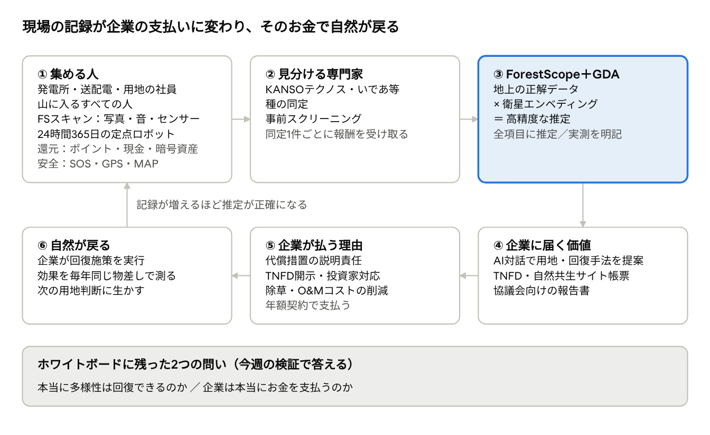
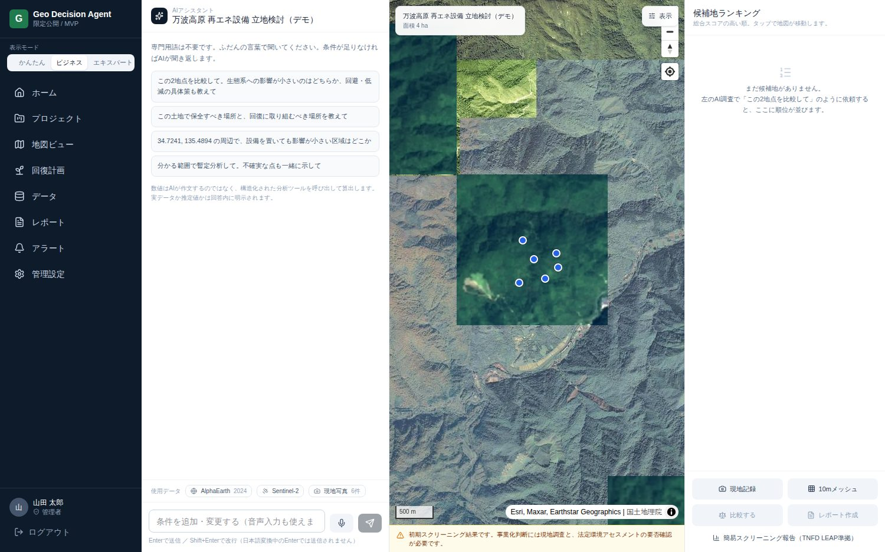
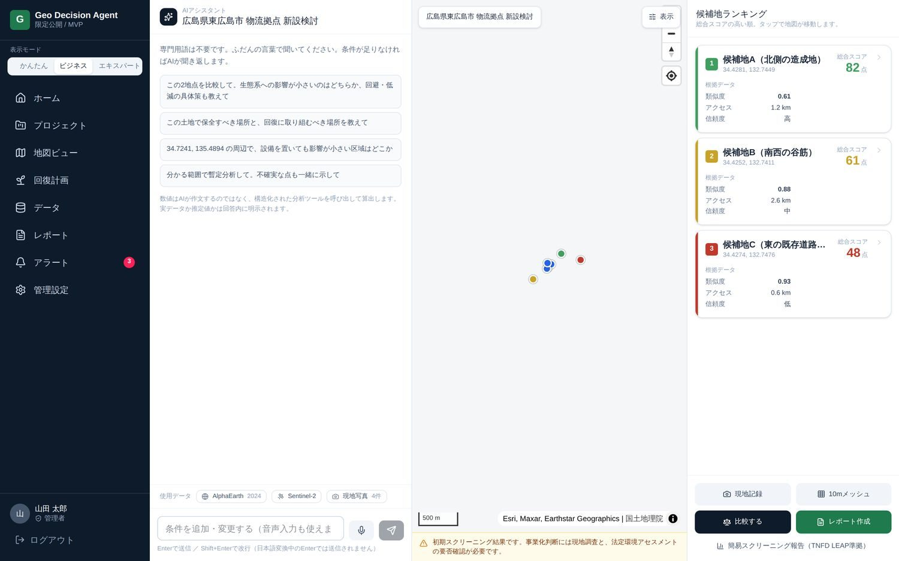
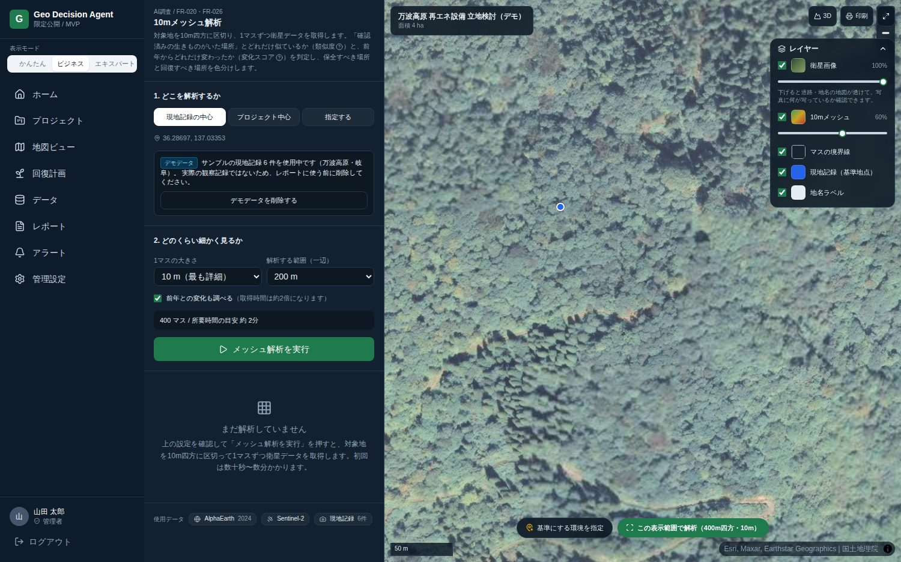
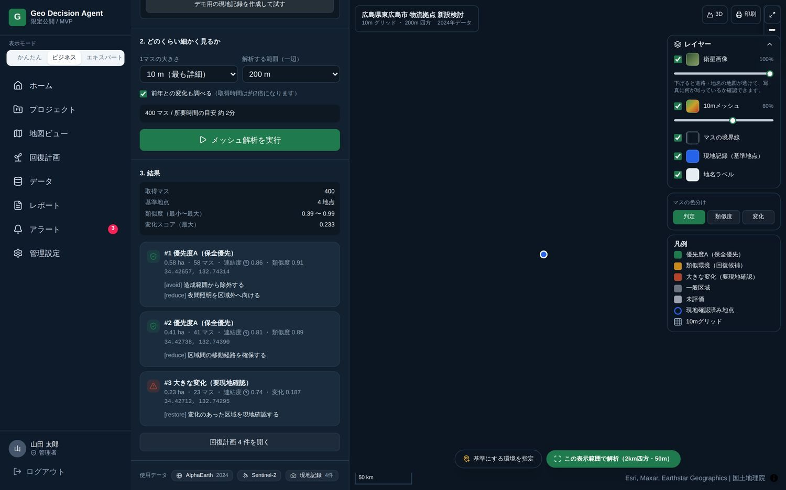
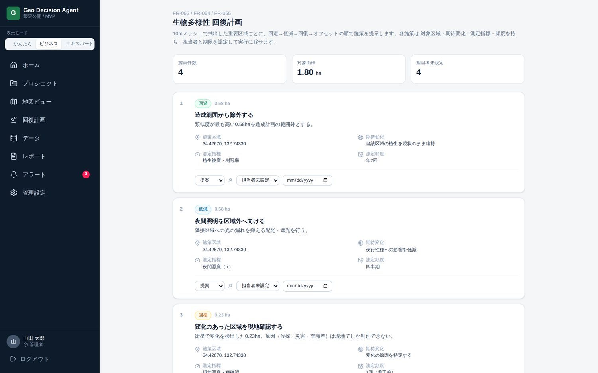
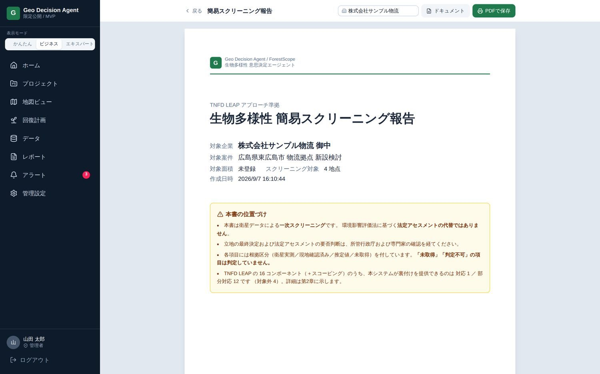
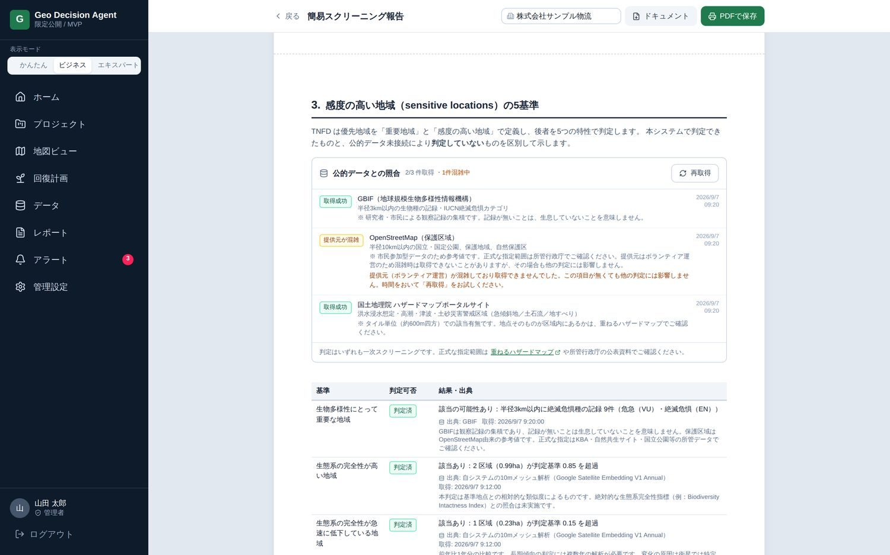
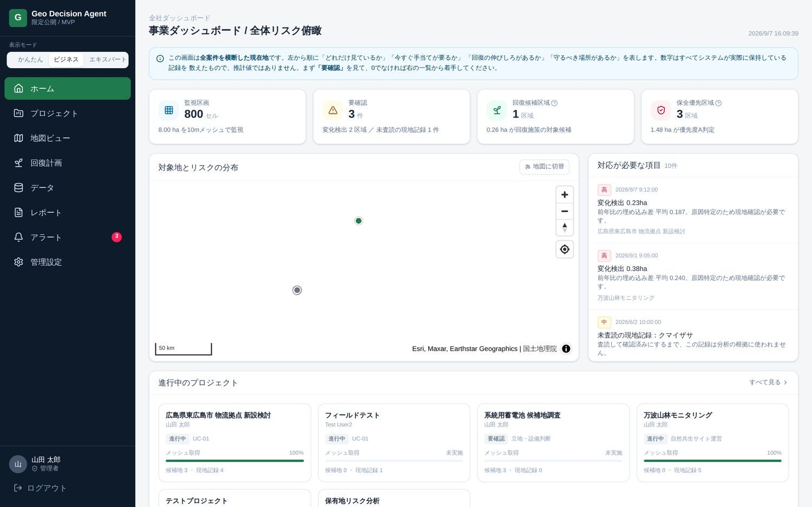
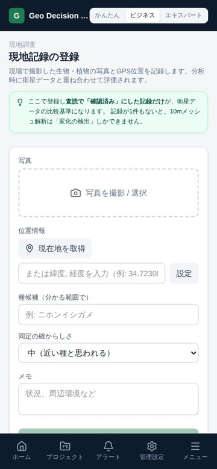

# TERRA 事業計画書（ForestScope原型版）

2026年9月30日 · 岡村 裕之

## 3分でわかるTERRA（はじめて読む方へ）

**ひとことで言うと：「街や発電所をつくるとき、生き物への影響を、宇宙（人工衛星）と現場の記録で確かめ、自然が本当に戻ったかを毎年証明する」仕事です。**

| 問い | 答え |
| --- | --- |
| **何に困っている人がいる？** | 風力発電所などをつくる会社は、「ここにいた生き物のために、別の場所に同じくらい良いすみかをつくりなさい」と国から求められることがある。でも、「同じくらい良い」を測る物差しがなく、効いているかは何年も分からない |
| **私たちは何をする？** | ①山に入る人がスマホで生き物を記録し、②専門家が種類を確かめ、③その「正解」と人工衛星のデータを掛け合わせて、「この場所は、元のすみかにどれくらい似てきたか」を数字で示す |
| **もう動いている？** | はい。中心の仕組み「Geo Decision Agent」はすでにインターネット上で動いている（実際の画面は「実際の画面で見るGeo Decision Agent」の章） |
| **誰がお金を払う？** | 最初は「代わりのすみかをつくるように求められた再生可能エネルギーの会社」。すでに調査にお金を払っているので、新しい予算をつくらなくてよい |
| **いくら稼ぐ？** | 1か所あたり年300万円から。1年目は小さく黒字、5年目に売上約4.5億円を目指す（前提は「収支計画」の章） |
| **どうして自然が戻る？** | 「効いていない」ことが早く分かれば、早く直せる。測らないままの「やったつもり」を減らすことが、回復の近道になる |

**たとえるなら、「自然の健康診断」。** 人間の健康診断では、毎年同じ検査をして「去年より良くなったか」を見る。大きな機械（衛星）で全身を大まかに調べ、気になるところはお医者さん（専門家）が直接診る。それと同じことを、森や野原に対して行う。

**専門家の方へ：** 本書はTNFD LEAP（自然関連の情報開示の国際的な手順）とミティゲーション・ヒエラルキー（回避→低減→回復→オフセット）に沿って設計しています。衛星由来の値はすべて「推定」、専門家が同定した現地記録は「実測」と書き分け、法定の環境アセスメントの代わりにはしません。

**この計画書の読み方：** 各章の最初の太字が「結論」です。急ぐ方は太字だけ読めば全体が分かります。知らない言葉は次の「用語ミニ辞典」を見てください。

## 用語ミニ辞典

**この計画書に出てくる専門用語を、ひとことで言い換えた表です。** 本文でも初めて出てくるところでは、できるだけ言い換えを添えています。

| 用語 | ひとことで言うと | もう少し詳しく |
| --- | --- | --- |
| 生物多様性 | いろいろな生き物がいること | 種類の多さだけでなく、森・川・草原などすみかの多さも含む |
| ネイチャーポジティブ | 自然を「減らさない」から「増やす」へ | 2030年までに自然の減少を止め、回復に転じさせるという世界の目標 |
| 環境アセスメント（アセス） | 造る前の「自然への影響テスト」 | 大きな発電所や道路は、法律で事前に調べて公表することが義務づけられている |
| 代償措置 | 壊した分の「代わりのすみか」をつくること | 例：風車の近くでイヌワシが狩りをしないように、離れた場所にエサ場をつくる |
| 事後調査 | 造った後の「本当に大丈夫だったか」の調査 | 予測どおりか、対策が効いたかを確かめる |
| 協議会 | 専門家を交えた「確認の会議」 | 大学の先生や自治体が、事業者の対策が効いているかを年に何回か確かめる |
| ミティゲーション・ヒエラルキー | 自然への影響を減らす「4つの順番」 | ①回避（場所を変える）→②低減（工夫で影響を小さく）→③回復（壊れた所を戻す）→④オフセット（別の場所で埋め合わせる）。上ほど優先 |
| TNFD | 企業が「自然との関わり」を報告する国際ルール | 自然関連財務情報開示タスクフォース。投資家が企業の自然リスクを判断するために使う |
| LEAP | TNFDが勧める「調べる4ステップ」 | Locate（場所を特定）→Evaluate（自然との関わりを評価）→Assess（リスクとチャンスを判断）→Prepare（対応を準備） |
| 自然共生サイト | 国が認めた「自然を守っている民間の土地」 | 環境省の認定制度。企業の森や工場の緑地などが対象（2026年6月で610か所） |
| ABINC認証 | 生き物に配慮した建物・緑地の認証 | マンションやオフィスビルの緑地づくりを外部が評価する |
| BNG（英国） | 「開発したら自然を10%増やす」義務 | Biodiversity Net Gain。英国で2024年2月から法律で義務化。30年間の管理計画（HMMP）が必要 |
| 人工衛星データ | 宇宙から撮った地球の写真や測定値 | 例：欧州のSentinel-2（センチネル2）は約5日に1回、同じ場所を撮影する |
| 衛星エンベディング | 土地の「特徴を表す数字の組」 | GoogleのAlphaEarth（Satellite Embedding）。10m四方ごとに、64個の数字で「その土地らしさ」を表す。数字が似ていれば、土地の様子も似ている |
| 類似度（コサイン類似度） | 2つの場所が「どれだけ似ているか」の点数 | 0〜1で表し、1に近いほど似ている。例：生き物が確認された場所との類似度0.85以上を「保全優先」としている |
| 10mメッシュ | 土地を10m四方のマス目に切ること | バレーボールのコート（約9m×18m）より少し小さいくらいのマスごとに判定する |
| 地上の正解データ（グラウンドトゥルース） | 現地で確かめた「本当の答え」 | 衛星の推定が合っているかを確かめる基準。多いほど推定が正確になる |
| 同定 | 生き物の種類を見分けること | 写真や鳴き声から「これはイヌワシ」などと専門家が決める |
| O&M | 発電所の「運転と手入れ」 | Operation & Maintenance。点検、修理、草刈りなど |
| エッジユーザー | 一番困っていて、もう自分で動いている人 | 新しい商品を最初に買ってくれる可能性が高い人 |
| ToBe／AsIs | 「ありたい姿」／「いまの姿」 | 2つの差が、解くべき課題になる |
| ROI | かけたお金に対する「もうけ」の割合 | Return on Investment。「300万円払って、いくら得するか」 |
| パイロット | 本番の前の「お試し導入」 | 1か所・1年だけ有料で試してもらう |
| LOI | 「やりたい」という意思を書いた紙 | Letter of Intent（意向表明書）。正式な契約の一歩手前 |
| 生成AI（LLM） | 文章で話せるAI | 本システムでは「説明と対話」だけを担当し、数字は計算プログラムが出す |
| セグメント | お客さんの「グループ」 | 同じ悩みを持ち、同じ売り方が通じる顧客のまとまり。例：風力事業者、デベロッパー |
| デベロッパー | 土地を開発して建物をつくる会社 | マンションや商業施設を企画・販売する不動産会社。例：積水ハウス、関電不動産開発 |
| 市場規模 | お客さん全員が買ったときの売上の合計 | 「顧客の数 × 1社あたりの単価」で計算する |

## ありたい姿（ToBe）

**「開発か、自然か」を、現場の誰かが我慢や善意で選ばなくてよくなっている世界。** 自然への配慮が、担当者の良心や熱意ではなく、事業の判断の手順そのものに入っている。「気をつけています」ではなく、「守れています」を毎年同じ方法で示せる。

その世界では、次のことが当たり前に起きている。

| 誰が | どう行動しているか |
| --- | --- |
| 山に入るすべての人（発電所・送配電・林業の現場の人） | 普段の仕事のついでにスマホで写真と音を記録し、安全（SOS・位置の共有）と対価を受け取っている |
| 記録ロボット群 | 人がいない時間も、24時間365日、音と写真で生き物を記録し続けている |
| 専門家（KANSOテクノスなど） | 集まった記録の種を判定し、検証を正式な有償の仕事としている |
| 事業を計画する企業 | 候補地を選ぶ初日に、どこに希少な生き物がいそうかを「問い合わせるように」知り、道のりを止めずに事業を進めている |
| 保全・回復を約束した企業 | 代替の餌場（エサ場）や回復地が「効いている」ことを、毎年同じ物差しで示し、協議会や投資家に胸を張って説明している |
| 自然 | 回復行動の結果が次の判断に戻り、生き物の多様性が少しずつ戻っている |

この世界の先に、岡村が個人として描く未来がある。**電気をつくるほど森と生き物が増え、その技術がやがて月や火星でも人と生き物の暮らしを支える。** 地球の生物多様性が損なわれた星から、人類が宇宙へ出ていくことはできない。地球を測り、守る技術は、その前提条件である。

この思いの原点は2つ。小学4年生のとき『 Newton』で宇宙の視点を得た日に、広島の里山で昆虫に囲まれて育った子どもが「昆虫博士」の夢を手放したこと。そして社会人になって山に通い、森を最もよく見ている人の記録が企業の判断に届いていないと気づいたこと。関西電力の生物多様性担当者から聴いた「現地調査をするにも範囲が広く全体ができない」（2026年1月・4月）という声が、事業を具体的に動かし始めた。

## 現状（AsIs）と、ToBeを阻んでいる課題

**結論：ToBeを阻んでいるのは技術ではない。業界が「着工前の評価書を納めること」に最適化されていて、「造った後、自然が本当に戻ったか」を証明する商品がどこにもないこと。** そのため、事業者は代償措置（壊した分の代わりのすみかをつくること）を約束しても、効いているかを数年間知ることができず、説明を先送りし続けている。

### いま現場で起きていること（ユーラスエナジー釜石の例）

| 事実 | 当事者が我慢していること |
| --- | --- |
| 2008年にイヌワシの衝突死亡事故。その後、釜石で最大57基の増設計画 | 事故が再び起きないか、運転中ずっと分からない |
| 2021年8月24日の環境大臣意見（国が事業者に出す正式な注文）で「質・量の両面で同等」の代替採餌場を求められた（楢ノ木平牧場） | **「同等」の物差しが決まっていない。** 何をもって同等と言えるかを、事業者が自分で説明するしかない |
| 専門家を入れた協議会（対策が効いているかを確かめる会議）を設置 | 協議会は慎重。前例のない方法（衛星データなど）は採用されにくい |
| 代替採餌場の効果は、イヌワシが実際に使うまで分からない | **効いているかが分かるのは数年後。** その間の説明材料がない |

### 業界の構造（なぜ誰も解決していないか）

1. **環境コンサルの売上は「着工前」に偏る。** アセス（造る前の自然への影響テスト）の方法書・準備書・評価書（国へ出す3段階の報告書）を納めた時点で仕事の大半が終わる。着工後の効果検証は、事後調査として最小限に行われるだけで、売り物として磨かれていない
2. **現地調査は高くて遅い。** 猛禽類（ワシやタカの仲間）は最低2営巣期（子育ての季節2回分＝約2年）の調査が要る。専門家の人数も限られる
3. **既存の衛星・GIS（地図にデータを重ねて分析する仕組み）サービスは「見える化」止まり。** 例：NTTドコモビジネス×バイオームの自然資本モニタリングは1エリア（25km²）250万円〜で2026年5月に提供開始。広く安く見られるようになったが、「この代償措置は元の場所と同等か」という**事業者の説明責任の問い**に直接は答えていない
4. **現場の記録が意思決定に届かない。** 発電所・送配電・用地の社員は毎日山に入っているが、見た生き物や異変は個人のスマホや日報で止まる

### 当事者がいまやっている「自前の対処」（=痛みがある証拠）

- Google Earth Proで過去画像を切り出して見比べる
- QGIS（無料の地図ソフト）で植生（生えている植物の種類）を手で塗り、面積を数える
- 協議会の委員に事前に個別相談して、反対されない説明を探る
- 自社で専門家や大学と組み、独自の方法論を作る（積水ハウス、王子HD。§4で詳述）

**お金と手間をかけて、すでに自分で何とかしようとしている。** ここに事業の入口がある。

### ToBeとのギャップ＝解くべき課題

| ToBe | AsIs | 課題 |
| --- | --- | --- |
| 開発前に、希少種の分布を「問い合わせるように」知れる | 毎回ゼロから2年かけて現地調査 | **地上の正解データが共有・蓄積されていない** |
| 代償措置が効いていることを毎年同じ物差しで示せる | 「同等」の定義がなく、効果は数年後に判明 | **効果を測る共通の物差しがない** |
| 現場の人がデータを集め、安全と報酬を得る | 記録は個人で止まり、山に入る人の安全は自己責任 | **集める人に動機と安全の仕組みがない** |
| 企業が「開発は自然にも良い」と胸を張れる | 開示はTNFDの定性記述（数字のない文章での説明）が中心 | **第三者が確かめられる証拠がない** |

## 宿題① いであのクライアントは誰か

**結論：いであの売上の86.2%は官公庁・公益法人で、民間は13.8%しかない。いであのクライアントの大半は、私たちの顧客にならない。** いであは顧客ではなく「専門家検証を担う協業先・販売チャネル（代わりに売ってくれる窓口）」と位置づけ、私たちが直接売る相手は、民間13.8%の中にいる事業者に絞る。

### 調べた事実

| 項目 | 内容 |
| --- | --- |
| 売上構成（2025年12月期） | 官公庁・公益法人 86.2%／民間 13.8% |
| 主要な発注者 | 国土交通省、防衛省、環境省（河川・ダム・道路・海域の環境調査、アセス） |
| 民間の発注者の典型 | 発電事業者（風力・火力・水力）、再エネ開発会社、鉄道・不動産の大規模開発 |
| 強み | 生物の同定・現地調査・分析の人員と実績。アセス図書の作成能力 |

出典：[いであ 決算情報](https://www.ideacon.co.jp/ir/management/results/)、[EDINET 有価証券報告書](https://edinetdb.jp/company/E04795/text)

### ここから分かること

1. **官公庁は「痛みを持った買い手」ではない。** 予算年度と仕様書で買い、新しい方法には前例を求める。最初の顧客には向かない
2. **民間13.8%の発注者こそ、自分のお金でアセスと事後調査を払っている人たち。** 工期の遅れが損失に直結し、協議会・知事意見・大臣意見に答える義務を負う。ここがエッジユーザーの候補（§4）
3. **いであは競合ではなく、私たちに欠けている「種の同定と専門家の信頼」を持っている。** ホワイトボードの「KANSOテクノス」の役割（種の同定・事前スクリーニング）を、いであ・KANSOテクノスなどの専門家に有償で担ってもらう形が自然

### 高岡さんへの回答（一言で）

> いであのクライアントは、ほぼ国。国は最初の顧客にならない。**いであの残り13.8%の民間発注者――特に、大臣意見で代償措置を義務づけられた発電事業者――がエッジユーザー。** いであ自身は、私たちの判定に専門家の裏付けを与える協業先にする。

## 宿題② 顧客とするべきエッジユーザー

**結論：最初に狙うのは「環境大臣意見などで代償措置を課され、効果を毎年説明しなければならない再エネ事業者」。** ユーラスエナジー釜石はその典型例であって、同じ立場の事業者が他にもいる。次点は「すでに自分でお金を払って自然の定量化を始めている企業」（積水ハウス、王子HD）。

### エッジユーザーの見分け方（4つの条件）

1. **痛みが直接的**：放っておくと工期・許認可・売上・コストに跳ね返る
2. **すでに自分で動いている**：お金か人手をかけて、痛みを回避・緩和している
3. **決める人に届く**：担当部署と予算の持ち主が特定できる
4. **繰り返し発生する**：一度きりではなく毎年・毎案件で起きる

### 候補の比較

| 候補 | 痛み | すでにやっている行動（証拠） | 判定 |
| --- | --- | --- | --- |
| **A. 代償措置を課された風力・再エネ事業者**（例：ユーラス 国内電源開発企画部 環境アセス担当） | 「質・量の両面で同等」の説明責任。効果が数年分からない | 代替採餌場の整備、専門家協議会の設置、事後調査の委託（[環境大臣意見 2021](https://www.env.go.jp/press/109907.html)、[Eurus 釜石](https://www.eurus-energy.com/assessment/48187)） | **◎ 最初の顧客** |
| **B. 太陽光・風力の保有者とO&M会社（運転と手入れを請け負う会社）**（関電グループ含む） | 草刈りと巡視のコスト。湿潤な日本では「荒れ地」ではなく「草が伸びすぎる」のが問題 | 1MWあたり年30〜80万円の除草費をすでに払っている（[ソルセル](https://solsell.jp/taiyoukou-zassou/)） | **◎ 収益の土台** |
| **C. デベロッパー**（積水ハウス、関電不動産開発） | 認証・販売での差別化、TNFD開示 | 積水ハウスは琉球大・シンク・ネイチャーと方法論と植栽ツールを作り、回復度を数値で公表（[積水ハウス](https://www.sekisuihouse.co.jp/company/topics/topics_2024/20240709_1/)）。関電不動産開発は一定規模案件でABINC認証を推進（[関電不動産開発](https://www.kanden-rd-sustainability.jp/environment/biodiversity/)） | **○ 2番手** |
| **D. 自社林を持つ製紙会社**（王子HD、日本製紙） | 森林の価値そのものが企業価値。TNFD開示とクレジット化（自然を守った成果を売買できる証書にすること） | 王子HDは社有林を5,500億円と評価し650拠点を採点。猿払で北大とドローン・カメラ・eDNA（水や土に残った生き物のDNAから種類を調べる方法）の調査（[日経ESG](https://project.nikkeibp.co.jp/ESG/atcl/column/00005/100300475/)、[王子HD](https://www.ojiholdings.co.jp/news/detail_002355.html)） | **○ 大口候補**（自前で作る恐れあり） |
| **E. 自然共生サイトの認定・申請者** | 認定後も毎年のモニタリングと報告 | 610か所（2026年6月）。申請支援50〜200万円、モニタリング年30〜100万円が相場とされる（**要確認**）（[環境省](https://www.env.go.jp/press/press_03222.html)） | **○ 数が多い** |
| **F. 関電社内**（発電所・送配電・用地・オプテージDC用地） | 山に入る社員の安全、用地選定、自然共生設計 | 巡視・点検で毎日山に入っている | **◎ データを集める側・社内実証**（払い手としては△） |
| G. ホテル（Marriottなど外資・インバウンド系） | グリーンツーリズムでの訴求 | 具体的な生物多様性の取り組みを見つけられなかった | **△ 証拠なし** |
| H. データセンター事業者 | 用地の地域合意 | NTTファシリティーズの地域共生モデル程度（[NTT-F](https://www.ntt-f.co.jp/news/2025/20251029-01.html)） | **△ 証拠薄い** |
| I. 英国BNGの生息地バンク（自然を回復させた土地を「単位」にして開発者へ売る事業者） | 30年間のHMMP（生息地の管理・モニタリング計画）で回復を証明し続ける義務（2024年2月から義務化） | 義務として毎年モニタリングしている | **○ 海外展開の本命** |

### なぜAが一番か

- **痛みが「義務」になっている。** 大臣意見・知事意見・協議会という第三者が毎年「効いているか」を聞く。善意ではなく、答えないと事業が止まる
- **すでに払っている。** 事後調査・協議会の運営・専門家への委託という予算の枠がある。新しい予算を作ってもらう必要がない
- **ToBeの中心そのもの。** 「代替生息地が効いていることを毎年同じ物差しで示す」は、ToBeの表に書いた世界の一行目

### 弱いと判断した候補と、その理由

- **ホテル**：高岡さんの仮説として調べたが、Marriott Japanで具体的な取り組みを見つけられなかった。インタビューで確かめるまで保留
- **データセンター**：用地の地域合意は痛みだが、生物多様性で解決している事例がほぼない。オプテージは社内実証（F）として扱う
- **濱田さん（イノベ副本部長）**：「本当に払うか」は社内予算の話になる。社外顧客の支払い実績を先に作ってから当てる

## 最初の顧客と、刺さる提案

**結論：最初の1社は「代償措置を課された風力事業者の環境アセス担当」。売るのは地図でも装置でもなく、「協議会に毎年出せる、代替生息地が効いていることの証拠」。** 1サイトの有料パイロットから始める。

### 顧客の姿（ペルソナ）

- **所属**：風力・再エネ事業者の国内電源開発企画部 環境アセスメント担当（ユーラスエナジーHDが最初の打診先）
- **抱えている案件**：大臣意見で代替採餌場・代替生息地を課された発電所。協議会が年1〜2回開かれる
- **毎年やらされていること**：事後調査を環境コンサルに委託し、協議会資料を作り、委員に事前説明する
- **本当に困っていること**：「同等です」と言い切る根拠がない。効いていなかった場合に早く気づけない
- **決裁の流れ**：担当者が起案 → 部長決裁（数百万円までなら部内予算で可能と想定。**要確認**）

### 刺さる提案（1枚で言うと）

> **「代替採餌場が元の餌場と『どれだけ似てきたか』を、衛星で毎月、現地で毎季、同じ物差しで示します。協議会には、推定と実測を分けて書いた報告書をそのまま出せます。」**

| 顧客の言葉 | 私たちの答え | 裏付け |
| --- | --- | --- |
| 「同等」の物差しがない | 元の生息地を基準に、代替地の類似度（衛星エンベディングのコサイン類似度＝土地の特徴を表す数字の組がどれだけ似ているか）を毎月出す | Geo Decision Agentで稼働中 |
| 効果が分かるのは数年後 | 植生の変化は数か月単位で追える。鳥が来る前に「環境が近づいているか」を先に示す | 10m解像度・64次元・年次＋月次の衛星データ |
| 衛星は協議会に通らない | 衛星は「推定」と明記し、現地の地上データ（カメラ・録音・目視）と専門家の同定で「実測」を付ける | 全項目に根拠区分（推定／実測）を付ける設計 |
| 委員に説明できない | TNFD LEAPと自然共生サイトの様式に沿った帳票を出す。AIと対話して質問に答えられる | LEAP帳票（TNFDの4ステップに沿った報告書）の出力は実装済み |

### 最初の取引の形

1. **無料の事前診断（1週間）**：公開情報だけで、対象サイトの類似度マップと簡易帳票を作って見せる
2. **有料パイロット（1サイト×1年、目安300万円）**：衛星月次＋現地の地上データ（FSスキャン＋定点機材）＋専門家同定＋協議会向け報告書2回
3. **本契約（年額）**：同社の他の代償措置サイト、事後調査対象サイトへ広げる

**ゲーム理論の資料で整理した通り、全員が続ける理由を持つ形にする。** 事業者は説明が楽になる、専門家は同定で報酬を得る、現場の人は集めたデータでポイントを得る、私たちはデータが増えるほど推定が正確になる。

### 2番手・3番手への横展開

- **B（太陽光・風力O&M）**：「除草の回数を減らしつつ、生物が増えたことを証明する」。除草費の削減分で払ってもらう
- **C（デベロッパー）**：ABINC認証・自然共生サイト取得後の「毎年のモニタリング」を安く代行する
- **D（王子HD等）**：自社で始めた地上調査を、FSスキャンと衛星で面に広げる

## 事業の仕組み（ホワイトボードの形）

**結論：現場で集めた記録を専門家が確かめ、衛星と掛け合わせて企業が使える判定に変える。企業はその判定で説明責任とコストの問題を解き、払ったお金の一部が集めた人と専門家に戻る。** 回るほど地上の正解データが増え、推定が正確になる。

| 役割 | 何をするか | 何を得るか |
| --- | --- | --- |
| ① 集める人（関電グループ社員から開始） | 巡視・点検のついでにFSスキャンで撮る・録る。定点ロボットが24時間365日記録 | ポイント・現金・暗号資産。SOS・GPS・地図で山の中の安全 |
| ② 専門家（KANSOテクノス、いであ等） | 種の同定、事前スクリーニング、報告書の確認 | 同定1件ごとの報酬。自社の調査の効率化 |
| ③ ForestScope＋Geo Decision Agent | 地上データと衛星エンベディングを合わせて推定。根拠区分を付ける | データが増えるほど精度が上がる（参入障壁） |
| ④⑤ 企業 | 用地判断・代償措置の効果確認・TNFD開示に使う | 説明が通る、工期が止まらない、除草・調査コストが下がる |
| ⑥ 自然 | 回復施策の効果が毎年測られ、効かないものは早く直される | 「やったつもり」ではなく本当に戻る |

**大事な設計：数値はAIに作文させない。** 判定は決定的なエンジン（同じ入力なら必ず同じ答えを出す計算プログラム）が出し、AIは説明と対話を担う。衛星は必ず「推定」、現地データと専門家同定は「実測」と書き分ける。

## 実際の画面で見るGeo Decision Agent

**結論：事業の中心になる「判定する仕組み」は、すでに動いています。** ふだんの言葉で聞く → 候補地を比べる → 10mのマス目で調べる → 対策を決める → 報告書にする → 現場で記録する、までが1つのアプリでつながっています。以下はその順に並べた実際の画面です。

> **画面写真について（正直な注記）** すべて本番と同じプログラムの画面です。ただし、表示している案件・会社名・現地記録は**デモ用のサンプル**で、実在の顧客のものではありません。①③⑨は2026年10月1日に撮影したもので、衛星写真は本物です（撮影環境の都合で、写真の細かさが場所によって不揃いに見えます）。②④〜⑧は2026年9月に操作ガイド用として撮影したもので、地図部分は白く写っています。

### ① ふだんの言葉で聞く

**何ができる：** 「この2地点を比べて、生き物への影響が小さいのはどちら？」のように、専門用語を使わずに聞けます。条件が足りなければAIのほうから聞き返します。真ん中の衛星写真の青い点は、現地で生き物が確認された場所です。

**専門家向け：** AIは数字を自分で作りません。あらかじめ許可した分析ツールを呼び出し、その結果だけを説明します（要件定義書FR-001〜004）。下の「使用データ」に、どの衛星データと何件の現地記録を使ったかが常に表示されます。

### ② 候補地を比べる

**何ができる：** 右側に候補地の順位が並びます。点数だけでなく、「なぜその順位か」の根拠（類似度＝生き物がいた場所にどれだけ似ているか、アクセス＝道路からの距離、信頼度＝どれくらい確かか）が一緒に表示されます。

**読み方の注意：** ここでは「生き物のすみかに似ている場所ほど、開発しないほうがよい」という考えで、類似度が低い候補地Aが1位になっています。画面の下には「事業化の判断には現地調査と法定アセスの確認が必要」と常に表示します。

### ③ 衛星写真を「10mのマス目」で調べる

**何ができる：** 調べたい土地を10m四方のマス目に切り、マスごとに「生き物が確認された場所にどれだけ似ているか」と「去年からどれだけ変わったか」を計算します。200m四方なら400マス、約2分です。写真は岐阜県の山林で、林道や木の一本一本まで見えます。

**専門家向け：** 各マスでGoogle Satellite Embedding（64次元・年次）を取得し、査読済みの現地記録地点の平均ベクトルとのコサイン類似度、前年比の変化スコアを算出します。地図上部の「デモデータ」表示のように、サンプルを使っているときは必ず画面に出します。

### ④ 色で判定する：「守る場所」「戻せそうな場所」「変わった場所」

**何ができる：** マスを色で分けます。

| 色 | 意味 | 判定の基準 |
| --- | --- | --- |
| 緑 | 優先度A＝守るべき場所 | 生き物がいた場所との類似度0.85以上 |
| 黄 | 似た環境＝回復の候補 | 類似度0.70以上 |
| 赤 | 大きな変化＝現地で確かめるべき場所 | 前年からの変化スコア0.15以上 |
| 灰 | 一般区域 | 上のどれにも当てはまらない |

左の一覧には、まとまった区域ごとに面積（ha＝100m四方）と、「造成範囲から外す（回避）」「夜の照明を外へ向ける（低減）」のような対策が並びます。**代償措置の証明では、この「類似度」を元のすみかと代わりのすみかの間で毎月測ることになります。**

### ⑤ 対策を「回避→低減→回復→オフセット」の順で決める

**何ができる：** 対策ごとに「どこで」「何が変わるはずか」「何で測るか」「どのくらいの頻度で測るか」が決まり、担当者と期限を入れてそのまま実行に移せます。必ず「回避（そもそもそこを使わない）」が最初に出るようにしています。

### ⑥ 報告書にする（TNFD LEAPに沿った「簡易スクリーニング報告」）

**何ができる：** ボタンひとつで、顧客に渡せる報告書（PDF）になります。表紙には「これは衛星による一次チェックであり、法律のアセスの代わりではない」と正直に書きます。

**⑦ 取れなかったデータを「問題なし」にしない。** 報告書では、絶滅危惧種の記録（GBIF＝世界中の生き物の観察記録のデータベース）や、洪水・土砂災害の危険区域（国土地理院）とも照らし合わせます。取得に失敗したときは「該当なし」ではなく「取得できなかった＝判定不可」と書きます。ここが、協議会の専門家に信頼してもらうための一番大事な設計です。

### ⑧ 全社の状況を一目で見る

**何ができる：** 経営者や環境部門が、すべての案件を横断して「どれだけ見ているか」「今すぐ手当てが必要なものは何か」を確かめられます。数字はすべて実際に保存されている記録を数えたもので、推計値ではありません。

### ⑨ 現場でスマホから記録する

**何ができる：** 山に入った人が、写真・位置・種類の候補をその場で記録できます。専門家が「確認済み」にした記録だけが、衛星データと比べる「正解」として使われます。**ホワイトボードの「FSスキャン」は、この画面を出発点に、鳴き声の録音・SOS・ポイントを足していく計画です。**

### できていることと、これから作るもの

| 機能 | いま | これから |
| --- | --- | --- |
| AI対話・候補地比較 | 稼働中 | ― |
| 10mメッシュ判定（衛星エンベディング） | 稼働中 | 代替地と元のすみかの「毎月の類似度レポート」 |
| LEAP報告書・公的データ照合 | 稼働中 | 協議会向けの様式 |
| スマホの現地記録・専門家の査読 | 稼働中 | 鳴き声の録音、SOS・GPS共有、ポイント |
| 24時間365日の定点機材 | 試作1号機の設計とプログラムが完成 | 現地設置 |
| 専門家への同定依頼と支払い | ― | KANSOテクノス・いであ等との協業 |

## 要件定義書v3.0で約束していること

**結論：製品の設計図である「要件定義書v3.0」（2026年8月31日）は、この計画書の「代償措置の証明」と同じ方向を向いています。** 要件定義書（何を作るかを決めた文書）が「製品」を、この計画書が「誰に売ってどう稼ぐか」を担当します。

> **「守っています」から「守れています」へ。「地図を見る」から「根拠をもって決める」へ。「配慮している」から「配慮できている」へ。** ―― 要件定義書v3.0 表紙より

### 製品の存在理由

要件定義書は、Geo Decision Agentの存在理由を「**生物多様性の減少を反転させ、増進へ転じること**」と定めています。理由は、企業の生物多様性対応のほとんどが「いまある拠点をどう守り、どう報告するか」に閉じていて、一番影響が大きい「次にどこに何を建てるか」に自然の視点が入っていないからです。発電所や工場の場所は一度決まれば数十年動かせません。

### 代表ユースケース（こう使う、という代表例）

| 番号 | 使い方 | 聞き方の例 | この計画書との関係 |
| --- | --- | --- | --- |
| **UC-01（主力）** | 生き物に配慮した立地・設備の判断 | 「この3候補地に発電所を建てるなら、生態系への影響が一番小さいのはどこか。回避・低減の具体策も」 | 商品②「用地スクリーニング」 |
| UC-02 | 自然共生サイトの運営と回復の確認 | 「回復効果が高い上位3区域は？5年更新の証拠に使える形で」 | 商品①「代償措置プルーフ」④「認証モニタリングLite」 |
| UC-03 | 電力設備・水力の流域と生態系の共生 | 「大雨の後、取水口に影響しそうな上流の区域と、そこにあるすみかは？」 | 商品③「自然配慮型O&M」、関電社内実証 |
| UC-09 | 現地調査の計画 | 「今日2時間で確認できるルートと撮影点を作って」 | ホワイトボードの「集める人」 |

### 判断の順番（UC-01の標準の流れ）

1. 利用者が、目的・候補地・期間・制約をふだんの言葉で入れる
2. AIが足りない条件を聞き返す
3. 候補地ごとに、10mメッシュで「すみかの重なり」「保護区域との近さ」「すみかのつながり（連結性）」を計算する
4. TNFDのLEAP（場所→関わり→リスク→対応）の順に結果を整理する
5. 対策を「回避→低減→回復→オフセット」の順で出す。**回避（場所を変える、配置をずらす）を常に最初に検討する**
6. 根拠・データの日付・信頼度・必要な現地調査を添えて答える
7. 保存・共有・報告書化・専門家レビュー依頼につなぐ

### やらないと決めていること（信頼のための線引き）

- **法定の環境アセスメントの代わりはしない**
- **衛星データだけで、生き物の種類や影響の原因を断定しない**
- AIだけで最終判断をしない。立地の最終決定など影響の大きい結論は、専門家レビューか現地確認を必須にする
- 希少種の位置は、表示をぼかしたりダウンロードを制限したりできるようにする

### 数字で置いている目標（導入6〜12か月の仮説）

| 目標 | この計画書での意味 |
| --- | --- |
| 少なくとも1件の実案件で、AIが出した回避・低減案が採用される | 最初の有料パイロットの成功条件そのもの |
| 初めての利用者の80%以上が、10分以内に分析結果を得られる | 現場の担当者が自分で使える＝コンサルに頼まなくてよい |
| 候補地比較・初期チェックの時間を半分以下に | 工期を止めない（宿題③の「効果」） |
| 分析結果の100%に、データの日付・出典・信頼度・推奨現地確認を付ける | 協議会にそのまま出せる |
| 報告書（TNFD・自然共生サイト報告を含む）の作成時間を半分以下に | 認証モニタリングを安く提供できる根拠 |

**関西電力グループの約13,836haの実証フィールド**（要件定義書に記載）は、社内で実証できる「最初の練習場」です。社外の顧客より先に、ここで地上の正解データを貯められます。

## なぜこのチームがやるのか

**結論：「宇宙から地球を測る力」と「現場で確かめる力」を両方持ち、しかも実際に動くものを自分で作れることが強みです。** 衛星データだけの会社も、現地調査だけの会社もありますが、その2つをつなぐところに空白があります。

| 経験 | やったこと | この事業で生きるところ |
| --- | --- | --- |
| JAXA「はやぶさ2」画像解析チーム（近畿大学） | 小惑星リュウグウの岩の高さを、影の長さから推定。着陸成功に貢献 | 「宇宙から撮った画像で、地上のものを測る」ことそのもの |
| 火星の鉱物研究（名古屋大学大学院） | 火星と地球にある「球状鉄コンクリーション」の人工生成に世界で初めて成功。実験装置はすべて自作 | 仕組みを自分で作り、確かめる力（定点機材も自作） |
| 関西電力 技術コンサルタント | 法人営業、DX、生成AIの業務活用（補助金検索エージェントなど） | 発電所・送配電・用地の現場と、法人顧客の両方を知っている |
| フィールドワーク | 毎月山に通い、生き物を記録している | 「現場の眼」。山に入る人の不安や手間が分かる |
| Geo Decision Agentの開発 | 要件定義から本番稼働までを自分で進めた | 構想だけでなく、動くものがある |
| 社内コミュニティ「宇宙部」 | 2025年7月に創部、80名を超える。「宇宙まちづくり勉強会 in 関西」も主催 | 社内で「集める人」を増やす土台 |

**共同創業者**の川浪嵩史さん（早稲田大学・メタンハイドレート研究出身）と、株式会社TERRA（設立準備中）として進めています。関西電力グループの起業チャレンジ「Spark」に採択されています。

**足りないものも正直に書きます。** 生き物の同定と協議会対応の実務は、チームの中にはありません。だから、KANSOテクノスやいであのような専門家を「顧客」ではなく「一緒に稼ぐ仲間」として組み込む設計にしています（「宿題①」の章）。

## 商品と価格

**結論：売るのは「判定と証拠」。機材は売らない。** 価格は、顧客が今すでに払っているもの（事後調査・除草・認証のモニタリング）より安く置き、差額を顧客の得にする。

| 商品 | 対象（§4） | 中身 | 価格（仮） | 価格の根拠 |
| --- | --- | --- | --- | --- |
| **① 代償措置プルーフ**（主力） | A 風力・再エネ事業者 | 元の生息地と代替地の類似度を衛星で毎月、地上データ（FSスキャン＋定点機材）と専門家同定で毎季。協議会向け報告書を年2回 | **1サイト年300万円**（パイロット同額） | NTTドコモビジネス×バイオームの「見える化」だけで1エリア250万円〜（[NTT](https://www.ntt.com/about-us/press-releases/news/article/2026/0528_2.html)）。当社は説明責任まで答えるので同等以上を狙える。事後調査の委託額は**要確認** |
| **② 用地スクリーニング** | A・C・F | 候補地を入れるとAIとの対話で希少種の可能性・似た場所・回避策を返す。LEAP帳票を出す | **1候補地30万円**／年間契約**月10万円**で使い放題 | 現地調査を始める前の「当たりをつける」費用。現地調査2年分の前に払える額 |
| **③ 自然配慮型O&M** | B 太陽光・風力の保有者とO&M会社 | 除草の要不要と時期を衛星と定点機材で判定。刈らない区画の生物の増加を記録 | **1MWあたり年15万円** | 除草費は1MWあたり年30〜80万円（[ソルセル](https://solsell.jp/taiyoukou-zassou/)）。1回減らせば元が取れる |
| **④ 認証モニタリング Lite** | C デベロッパー、E 自然共生サイト | ABINC・自然共生サイトの毎年の報告に使うデータと帳票 | **1サイト年40万円** | 相場とされる年30〜100万円（**要確認**）の下側 |
| **⑤ データ提供** | D 製紙会社、環境コンサル | 地上の正解データと推定結果をAPI（他社のシステムから直接データを取り出せる窓口）で提供。いであ等はこれを使って自社の報告書を作る | 年額契約・個別見積り | コンサルの現地調査を減らす |

### お金の分け方（ホワイトボードの「集める人にお金」）

- **集める人**：売上の約10%をポイントで還元。現金・暗号資産に交換できる。まずは関電グループ社員が巡視のついでに記録する形で始める（社内規程の確認が要る）
- **専門家**：同定1件あたりの単価で支払う。売上の約15%を想定
- **安全機能**（SOS・GPS・地図）は、集める人には無料。山に入る社員の安全対策として、会社側にも価値がある

### 売らないもの

- **機材そのもの**：定点機材（TERRA Seed）は当社が設置して持ち、データだけを売る。機材売りは一度きりで、データが貯まらない
- **数値の作文**：AIは説明と対話を担当し、判定の数値は決定的なエンジンが出す

## 宿題③ どのセグメントが、いくら、何の「効果」に払うか

**結論：ROIの「効果」はセグメントごとに違う。一番大きいのは風力事業者の「工期が止まらないこと」で、数日の遅れを防ぐだけで年300万円の元が取れる。** 除草削減は分かりやすいが効果が小さく、単独では弱い。デベロッパーとホテルの効果はまだ数字にできない。

| セグメント | 払う額（§7） | 効果（何に払うか） | 効果の大きさ（試算） | 確かさ |
| --- | --- | --- | --- | --- |
| A 風力・再エネ | 年300万円／サイト | **工期の遅れを防ぐ**、協議会対応の手間を減らす、効かない代償措置に早く気づく | 50MW（一般家庭約2万7千世帯分の電気をつくる規模。1世帯年4,000kWhで計算）・設備利用率25%（1年中フル稼働した場合に対する実際の発電量の割合）・1kWhあたり20円と仮定すると、売電は年約22億円＝**1日約600万円**。運転開始が1日遅れるだけで年額を超える | 高い（義務がある）。ただし「当社のおかげで遅れなかった」の証明は難しい |
| B 太陽光O&M | 年15万円／MW | 除草回数の削減 | 除草年30〜80万円／MWのうち1回減らすと約10〜27万円の削減 | 中。小さな発電所では元が取れない。**生物多様性の証明とセットで売る** |
| C デベロッパー | 年40万円／サイト | 認証の維持、販売時の訴求、TNFD開示 | 販売価格や売れ行きへの効果は**未検証** | 低〜中。積水ハウスは払っているが、効果の数字は公表されていない |
| D 製紙会社 | 個別 | 650拠点の現地調査を減らす、クレジット化の証拠 | 社有林5,500億円という資産の裏付け。数字はインタビューで聞く | 中。自前で作る可能性がある |
| E 自然共生サイト | 年40万円／サイト | 毎年のモニタリング費の削減 | 相場年30〜100万円（**要確認**）との差額 | 中 |
| G ホテル | ― | グリーンツーリズムの訴求 | **数字にできない** | 低 |

※ Aの試算は仮定（50MW、25%、20円/kWh）による。実際の売電単価・規模は案件で変わる。

### 「企業は本当にお金を支払うのか」へのいまの答え

- **払うと言える根拠**：Aは大臣意見・協議会という外からの義務があり、すでに事後調査と代替地にお金を使っている。NTT×バイオームが250万円〜で商品を出したことは、この価格帯に買い手がいると大手が判断した証拠
- **まだ言えないこと**：衛星を使った証拠を協議会が受け入れるか。担当者の決裁権限で300万円が出せるか
- **確かめ方**：今週のインタビュー（§11）で「最後に事後調査にいくら払ったか」「誰が決めたか」を聞く。気持ちではなく過去の支払いの事実を聞く

### 「本当に多様性は回復できるのか」へのいまの答え

- 当社が約束できるのは「回復させる」ことではなく、**「回復しているかどうかを毎年同じ物差しで正直に示す」こと**。効かない施策を早く見つけて直せることが、結果として回復の確率を上げる
- 積水ハウスは「5本の樹」で在来種・鳥・蝶の増加を数値で公表しており（[サステナブル・ブランズ](https://www.sustainablebrands.jp/news/jp/detail/1223251_1501.html)）、測れば回復は示せるという前例はある

## 宿題④ 事業規模は？ ニッチすぎないか

**結論：痛みが一番強い国内市場（代償措置を課された再エネ＋認証サイト）だけなら年7〜8億円規模で、正直に言えばニッチ。ただし、それは入口として狙った結果。** 同じ仕組み（地上の正解×衛星）で、TNFD開示企業の全拠点と英国BNGへ広げられるので、事業の天井はそこで決まる。

### 国内：痛みが強い市場（最初の5年で取りに行く範囲）

| セグメント | 数（事実） | 狙う数（仮定） | 単価 | 市場規模 |
| --- | --- | --- | --- | --- |
| A 風力・再エネの代償措置 | 風力のアセス手続は累計425件（2020年度末）[参議院調査室](https://www.sangiin.go.jp/japanese/annai/chousa/rippou_chousa/backnumber/2022pdf/20220601028.pdf)。風車は2,866基（2025年末）[JWPA](https://jwpa.jp/en/information/12673/) | 代償措置・事後調査を抱える案件を2割＝**約85サイト** | 年300万円 | **約2.6億円** |
| A 新規案件の用地スクリーニング | 2025年の新規は24発電所 [JWPA](https://jwpa.jp/en/information/12673/) | 年30社の年間契約 | 年120万円 | **約0.4億円** |
| B 太陽光・風力O&M | 関電グループと大手発電事業者の保有分 | **1,000MW** | 年15万円/MW | **約1.5億円** |
| C デベロッパー（ABINC認証） | ABINC認証145件（2023年7月）[ABINC](https://www3.abinc.or.jp/) | 全件 | 年40万円 | **約0.6億円** |
| E 自然共生サイト | 610か所（2026年6月）[環境省](https://www.env.go.jp/press/press_03222.html) | 半数＝**約300か所** | 年40万円 | **約1.2億円** |
| D 製紙会社の社有林 | 王子HD 650拠点ほか | 2〜3社 | 年1,000〜3,000万円 | **約0.6億円** |
| **合計** |  |  |  | **約7億円／年** |

※「狙う数」は仮定。特にAの「2割」は根拠がなく、インタビューで代償措置の実例数を確かめる（§11）。

### 「ニッチすぎないか」への答え

1. **入口はニッチでよい。むしろニッチでなければならない。** 痛みが強く、すでにお金を払っている人から始めないと、最初の1社が取れない。ここで「協議会に通った実績」を作ることが次の市場への切符になる
2. **2段目：TNFD開示企業の全拠点。** 日本はTNFDの採用表明企業数が世界で最も多い国のひとつ（件数は要確認）。1社あたり数十〜数百の拠点を持つので、拠点単価を下げても市場は一桁大きくなる
3. **3段目：英国BNG。** 2024年2月から開発に10%の生物多様性純増が義務化され、30年間の管理・モニタリング計画（HMMP）が要る。2026年5月からは国家的大規模インフラにも広がる。**「30年間、毎年同じ物差しで回復を証明する」需要が法律で作られている市場**
4. **4段目：地上データそのもの。** 集めた地上の正解データは、他社の衛星推定の精度を上げる教師データ（AIに正解を教えるためのデータ）としても売れる。データが増えるほど他社が追いつけない

### 数えるときの注意

- 事業者数・案件数の数字は、公開資料から拾える範囲のもの。**代償措置を課された案件数そのものの統計は見つかっていない**
- 単価は仮置き。パイロットで実際に払ってもらえた額に置き換える

## 収支計画（5年）

**結論：初年度から小さく黒字（約200万円）、5年目に売上約4.5億円・営業利益約1.5億円、5年累計で約3億円の黒字。** 機材を売らず、Geo Decision Agent がすでに動いているので、初期投資がほぼ要らないことが効いている。

単位：百万円

|  | 1年目 | 2年目 | 3年目 | 4年目 | 5年目 |
| --- | --- | --- | --- | --- | --- |
| ① 代償措置プルーフ（サイト数） | 9.0（3） | 24.0（8） | 60.0（20） | 96.0（32） | 135.0（45） |
| ② 用地スクリーニング（年間契約社数） | 3.6（3） | 9.6（8） | 18.0（15） | 26.4（22） | 36.0（30） |
| ③ 自然配慮型O&M（MW） | 9.0（60） | 30.0（200） | 67.5（450） | 90.0（600） | 120.0（800） |
| ④ 認証モニタリング Lite（サイト数） | 2.4（6） | 12.0（30） | 32.0（80） | 56.0（140） | 80.0（200） |
| ⑤ データ提供（製紙会社など） | ― | ― | 15.0 | 20.0 | 45.0 |
| 英国BNG | ― | ― | ― | 10.0 | 30.0 |
| **売上合計** | **24.0** | **75.6** | **192.5** | **298.4** | **446.0** |
| 集める人への還元（10%）＋専門家の同定料（15%） | 6.0 | 18.9 | 48.1 | 74.6 | 111.5 |
| 人件費（人数） | 10（1） | 30（3） | 60（6） | 90（9） | 120（12） |
| 衛星・クラウド・機材・営業ほか | 5.9 | 14.0 | 31.0 | 49.0 | 67.0 |
| **営業利益** | **2.1** | **12.7** | **53.4** | **84.8** | **147.5** |
| **累計** | **2.1** | **14.8** | **68.2** | **153.0** | **300.5** |

### 前提

- 1年目は関電グループの発電所（③）と、代償措置を抱える風力事業者3サイト（①）でスタートする
- 人件費は1人あたり年1,000万円で計算。1年目は岡村1人
- 定点機材は初期費用ゼロ版（手持ちのポータブル電源＋古いスマホ）から始め、1台数万円以内に抑える
- 5年目の国内売上（約4.2億円）は、§9で数えた国内市場（約7億円）の6割。**高めの置き方なので、パイロットの結果で見直す**

### 厳しめに見た場合

- **①が1年目に1件も取れない場合**：1年目の売上は約1,500万円、約500万円の赤字。2年目に①が取れれば、3年目までに単年黒字に戻る
- **①の単価が半分（150万円）しか通らない場合**：5年目の営業利益は約1.0億円に下がるが、黒字は保てる
- **一番効くのは①の件数。** だから最初の1社の有料パイロットに集中する

## 今週の検証：誰に、何を聞くか

**結論：聞くのは「欲しいか」ではなく「最後にいつ、いくら払って、誰が決めたか」。** 過去の行動と支払いの事実だけが、ホワイトボードの2つの問いに答える。

### インタビュー先（優先順）

| 優先 | 相手 | 確かめること | つながり方 |
| --- | --- | --- | --- |
| 1 | ユーラスエナジーHD 国内電源開発企画部 環境アセス担当 | 代償措置の事後調査の費用、決裁の流れ、協議会で衛星が通るか | 資料で整理した経路（要確認） |
| 2 | 関電 再エネ部門の風力アセス担当 | 社内に同じ痛みがあるか。代償措置を抱える案件の数 | 社内 |
| 3 | 関電 用地部門、送配電の巡視担当 | 山に入る頒度、記録を残す気になる条件（ポイント・安全）、社内規程の壁 | 社内 |
| 4 | 関電不動産開発（ABINC担当） | ABINC取得・維持にいくら払ったか、販売で効いたか | グループ会社 |
| 5 | 積水ハウス（「5本の樹」担当） | シンク・ネイチャーとの取組みで満たせていないこと。完成後の実測をどうしているか | 公開窓口・展示会 |
| 6 | 王子HD 森林資源・サステナビリティ部門 | 650拠点の採点にかかった手間、猿払の方法を広げられない理由 | 公開窓口 |
| 7 | KANSOテクノス、いであ（協業候補） | 同定を件数単価で受けられるか、民間客の事後調査の規模 | 高橋りなさん（技術コンサル）経由も検討 |
| 8 | 濱田さん（イノベ副本部長） | 社内での買い手・出資の可能性。社外の支払い実績を先に作ってからでも良い | 社内 |

### 共通の質問（過去の事実を聞く）

1. 最後に「自然への影響」で事業が止まりかけたのはいつですか。何が起きましたか
2. そのとき、誰に、何を頼み、いくら払いましたか
3. その費用は誰が決めましたか。どの予算から出ましたか
4. 協議会や审査会で、一番答えにくかった質問は何ですか
5. 今、それをどうやって凌いでいますか（Google Earth、QGIS、委員への事前相談など）
6. 衛星の推定を資料に入れたことはありますか。入れたら、何と言われましたか

### 最後に見せるものと、頼むこと

- 相手の拠点で作った**類似度マップとLEAP帳票の試作**を見せる
- 「これを次の協議会に出せるなら、いくらなら試しますか」と聞き、\*\*有料パイロットの意向表明（LOI）\*\*まで進める

### 今夜のメンタリングで高岡さんに相談したいこと

1. いであを「顧客」ではなく「協業先」と置く判断でよいか
2. 最初の顧客を「代償措置を課された風力事業者」に絞ること、ホテル・データセンターを後回しにすること
3. ユーラス以外の風力事業者へのつながり方

## リスクと対策

| リスク | 起きるとどうなるか | 対策 |
| --- | --- | --- |
| **衛星の推定が協議会で認められない** | 主力商品①が売れない | 衛星は「推定」と明記し、専門家の同定で「実測」を付ける。協議会の委員に最初から検証に入ってもらう |
| **判別できない指標を出してしまう** | 「効いている」と誤って示し、信用を失う | 新しい指標は必ず「該当する場所」と「該当しない場所」の両方で確かめてから使う。取得失敗は「判定不可」と表示する |
| **大手が同じことを始める**（NTT×バイオームなど） | 価格競争になる | 大手は「見える化」。当社は「代償措置の説明責任」に絞り、現場の地上データと関電の現場の人材で差をつける。協業も選択肢 |
| **集める人が集まらない** | 地上データが貯まらず精度が上がらない | まずは関電グループの巡視業務に組み込む。安全機能（SOS・GPS）を入口にする。定点ロボットで最低限を補う |
| **希少種の位置情報が漏れる** | 密猟・盗採を招く | 希少種の正確な座標は顧客と専門家にしか見せない。公開用はメッシュ単位にぼかす |
| **報酬（暗号資産）の法規制** | 暗号資産交換業の規制に触れる | 最初は社内ポイントと現金だけにし、暗号資産は法務確認後 |
| **関電社員が業務中に記録して報酬を得ること** | 社内規程・労務管理と衝突 | 業務の一部として扱うか、報酬は部署単位にするなど、人事・法務と先に決める |
| **本当に多様性が回復しない** | 「グリーンウォッシュ（環境に良いふりをすること）の道具」と批判される | 回復していないときも「回復していない」と書く。正直さが商品の価値そのもの |
| **プラットフォームの処理上限** | サイトが増えると判定が出せない | 1回の処理の外部呼び出し数を数えて設計する。定期の自己診断で衛星データの取得失敗を検知する |

## 出典

**要確認**と書いた数字は検索結果の要約から取ったもので、原資料での確認が済んでいない。

**顧客・業界**

- いであ：[決算情報](https://www.ideacon.co.jp/ir/management/results/)、[有価証券報告書（EDINET）](https://edinetdb.jp/company/E04795/text)
- ユーラスエナジー釜石：[環境大臣意見（2021年8月24日）](https://www.env.go.jp/press/109907.html)、[Eurus 環境アセスメント](https://www.eurus-energy.com/assessment/48187)
- 積水ハウス：[ネイチャーポジティブ方法論（2024年7月）](https://www.sekisuihouse.co.jp/company/topics/topics_2024/20240709_1/)、[サステナブル・ブランズ](https://www.sustainablebrands.jp/news/jp/detail/1223251_1501.html)
- 関電不動産開発：[生物多様性の保全](https://www.kanden-rd-sustainability.jp/environment/biodiversity/)
- 王子HD：[日経ESG](https://project.nikkeibp.co.jp/ESG/atcl/column/00005/100300475/)、[TNFDレポート2025](https://www.ojiholdings.co.jp/news/detail_002355.html)
- NTTファシリティーズ：[地域共生型データセンター](https://www.ntt-f.co.jp/news/2025/20251029-01.html)

**価格・市場**

- NTTドコモビジネス×バイオーム：[自然資本モニタリングソリューション（2026年5月）](https://www.ntt.com/about-us/press-releases/news/article/2026/0528_2.html)
- 太陽光の除草費：[ソルセル](https://solsell.jp/taiyoukou-zassou/)
- 自然共生サイト：[環境省](https://www.env.go.jp/press/press_03222.html)、[ELEMINIST](https://eleminist.com/article/4569)（費用相場は要確認）
- ABINC認証：[いきもの共生事業推進協議会](https://www3.abinc.or.jp/)
- 風力の導入量：[JWPA 2025年末](https://jwpa.jp/en/information/12673/)
- 風力のアセス件数：[参議院 環境影響評価制度の動向と課題](https://www.sangiin.go.jp/japanese/annai/chousa/rippou_chousa/backnumber/2022pdf/20220601028.pdf)

**社内資料（添付）**

- ToBe Designシート（ユーラスのAsIs・ToBe・本質価値）
- ワークショップ資料（エッジユーザー、業界分析）
- ForestScope ゲーム理論の整理（単一サイト有料パイロット）
- §15 差し替え案（ToBeの言葉、原点）
- ホワイトボード写真（事業ループ、2つの問い）

**製品・チーム**

- [Geo Decision Agent 要件定義書 v3.0（2026年8月31日）](https://docs.google.com/document/d/1XMcvaCZg_h-sTlm6jF3mtJBWN0F3k_niRm2rQ1vIehE/edit)
- [岡村裕之 ポートフォリオ（京都芸術大学 生物多様性アートプロジェクト）](https://docs.google.com/document/d/18OZ_Jx7sxl3eAFnU1sDT9pm8minfQpb-MO0k1yQcC44/edit)
- Geo Decision Agent 操作ガイド（画面写真②④〜⑧の出典）、稼働中アプリの画面（①③⑨、2026年10月1日撮影、衛星写真：Esri・Maxar・Earthstar Geographics・国土地理院）
